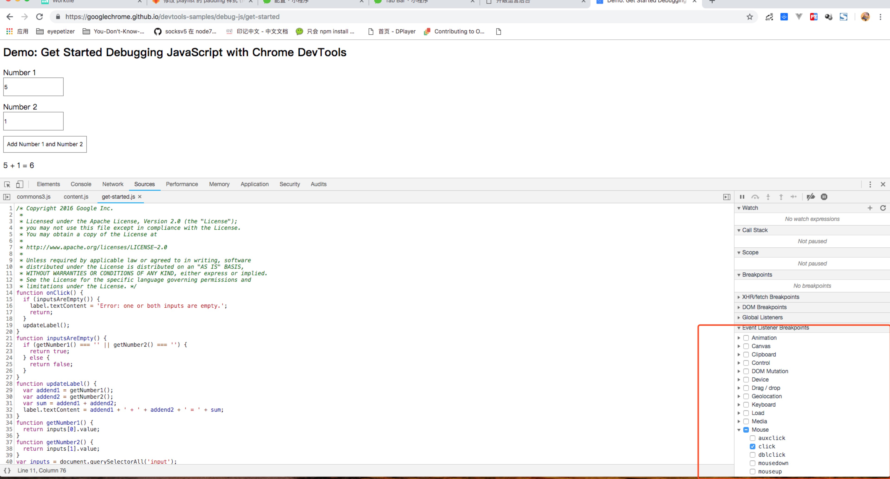

## google浏览器开发者工具如何使用断点

作为一个开发者，怎么找到和修复 bug 可能是经常出现的问题，可能经常使用 console.log() 把代码值打印在控制台看是否正确；这里，它将彻底的改变了。   
这里会介绍怎么正确的 debugging，也将学到怎么使用 Chorme Developer Tools 设置断点在代码里面逐行执行，这样就能高效的发现和解决出现在代码里面的一些问题。   
本文的目标是展示怎样修复一个特殊的 bug，用工作流程的方式有助于学习。

### 1. 复现 Bug
复现 bug 是找出并修复 bug 的第一步，复现 bug 意味着用一系列的方法来找出当前导致 bug 的代码位置。而复现 bug 需要很久的时间，因此就需要用便捷的方法去掉不需要的步骤。   
跟随下面的步骤说明来复现并修复一个问题：
- 这里有一个网页在教程中作为 demo，请确定你已经用一个新的 tab 在浏览器打开， [open demo](https://googlechrome.github.io/devtools-samples/debug-js/get-started){:target="_blank"}；
- 在示例网页中，在 Number 1 的输入框输入 5，在 Number 2 的输入框输入 1；
- 点击 Add Number 1 And Number 2；
- 查看最终输出的结果是： `5 + 1 = 51`；

噢。。。为什么结果错了，正确的不应该是 `6` 吗？这个 bug 就需要去找出并修复它。

### 2. 通过断点(breakpoint)暂停代码的执行
开发者工具让你在代码的执行过程中暂停你的代码执行，并且在当前暂停时刻可以查看所有变量的值；这里能暂停代码执行的就是断点(breakpoint)。
- 回到示例网页，通过快捷键Command + Option + I(Mac) 或者 Control + Shift + I(windows,linux)；
- 点击 Sources 面板；
- 点击右侧的 Event Listener Breakpoints 并展开，开发者工具会显示出一个事件分类列表，如 Animation 和 Clipboard；
- 接着移动到 Mouse 事件类型，并展开它；
- 选中里面的 click 多选框；

- 回到示例，再次点击 Add Number 1 And Number 2，在 sources 面板下方暂停并高亮显示了代码在具体的一行：
``` javascript
  function onClick() {
```
**为什么停留在这里？**   
当选中了 click 之后，前面设置的基础事件断点在所有的 `click` 事件上。当任何节点被点击的时候，当前节点都会有一个 `click` 事件处理程序，开发者工具会自动暂停在节点调用的 `click` 事件处理程序的第一行。

### 一步一步执行代码
