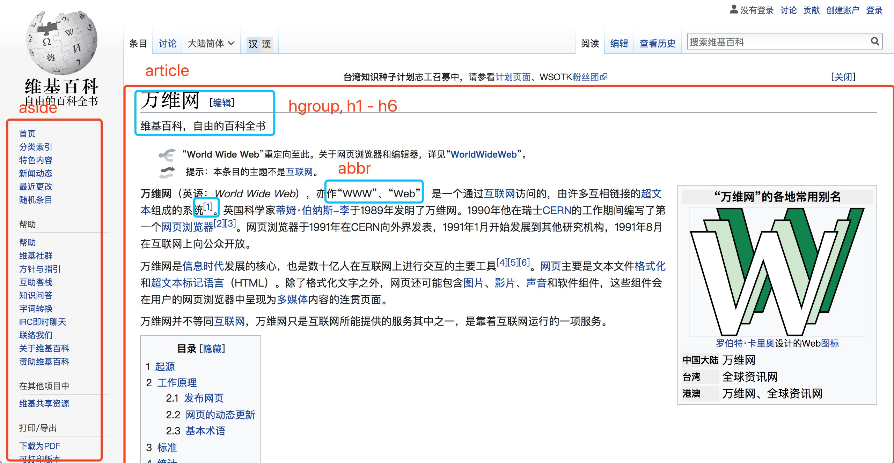
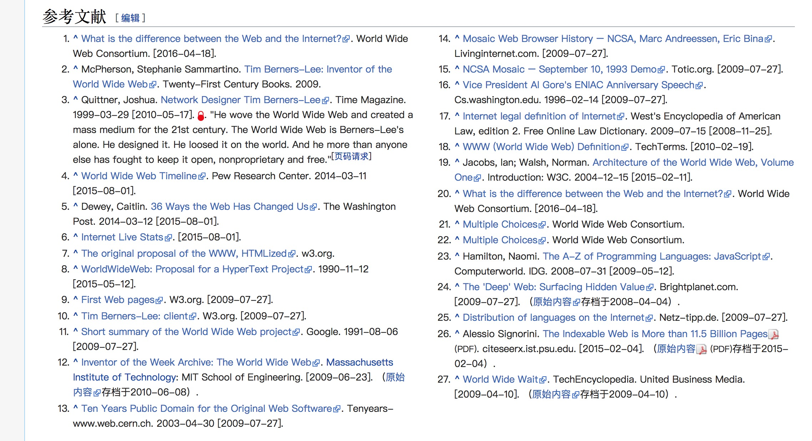
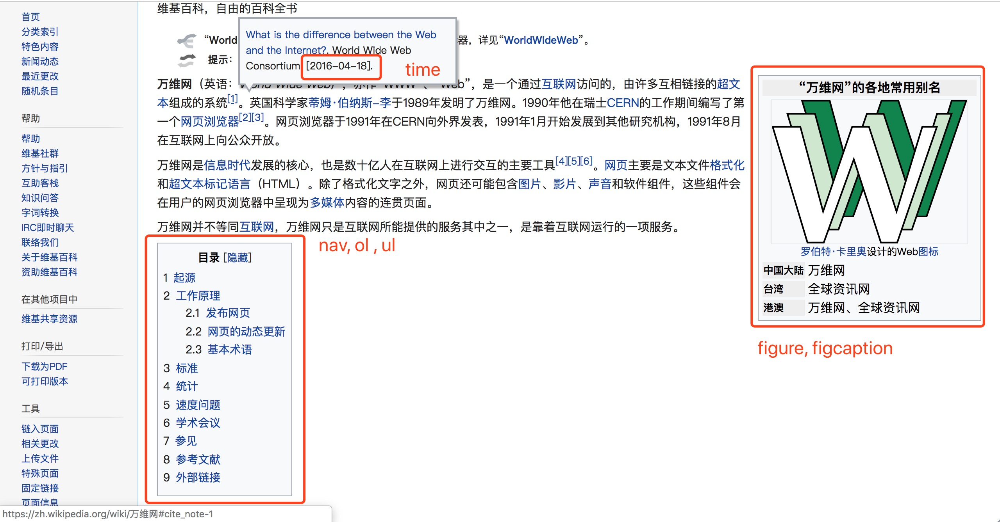

# HTML 语义，如何运用语义类标签来呈现网页

在上一篇文章主要学习了怎么使用语义类标签和正确使用的一些场景，那么具体在哪些场景适合用到，又该怎么运用呢？  
这里通过一个例子来做一个语义类标签的学习，找一篇 wiki 文章，通过文章的结构用语义类标签来进行学习，例如：  

在上图中，分别用不同的颜色做了标注，可以看出在左侧有一个类目侧边栏，在语义类标签中它就属于 aside 内容，属于导航性质内容；而页面右边最大的一个区域，它是文章的主体，因为主体部分有明确的独立性，所以这里可以用 article 来进行包裹；在主体内容的第一行，分别是一个大标题和一个小标题，那么在语义类的文章结构中，这里是不是可以用 h1-h6 标签来进行处理，并且它们是一个标题组，so，hgroup 完全符合语义；其代码结构可以如下：

``` javascript
<hgroup>
  <h1>万维网</h1>
  <h2>维基百科，自由的百科全书</h2>
</hgroup>
```

再继续往下看，在页面中间出现了 WWW(World Wide Web) 的缩写内容，在语义类标签中缩写用标签 abbr 来进行表示，因此出现 WWW 的地方都应该用 abbr 标签包裹；除了缩写以外， WWW 又被加粗了，那在符合语义的情况下用 strong 标签完全没问题。  
再继续走，下面出现了一个方括号的[1]，这个内容如果把鼠标移入时会出现一个悬浮内容，这就是论文中常见的“引述”内容，而 HTML 中，有三个跟引述相关的标签 blockquote 表示段落引述内容，q 表示行内的引述内容， cite 表示引述的作品名，搞清楚这三个标签在引述时的作用基本上就能正确使用；通常在文章的结尾会有很多的参考文献内容，这里的所有作品名称也应该加入 cite 标签作为引述内容，例如：

  
通过前面的图和解释，基本上把图片上的内容作了一个简单的处理，除此之外，在页面中还有段落内容，那这种段落内容直接用 p 标签就 OK 了；下面接着看：

在引用标签上，除了文章引用的内容外，还出现了日期，为了让机器阅读更有利，这里可以加上 time 标签；而右侧，出现了几张图片，这种出现在文中的图片，不仅仅是一个 img 标签，它和下面的文字组成了一个 figure 的语法现象，figure 也是我们的一种标签(用于表示与主文章相关的图像、照片等内容)；结构可以为：

``` javascript
<figure>
  
  <figcaption>slslslfls****</figcaption>
</figure>
```

这种插入文章中的内容，不仅限图片、代码、表格等，只要是具有一定自包含性的内容都可以用 figure，用 figcaption 表示内容的标题，当然也可以没有标题。  
接下来，在几个段落之后，看到了文章的目录，这里的目录链接到文章的各个章节，语义的场景可以使用 nav 标签，因为这里的目录结构顺序不可以随意变化，所以这里使用多级的 ol 结构；如下：

``` javascript
<nav>
  <h2>目录</h2>
  <ol>
    <li><a href="***">***</a></li>
    <li><a href="***">***</a></li>
    <li><a href="***">***</a></li>
  </ol>
</nav>
```

虽然这里使用的是 ol，但是我们应该知道还有一个表示无序列表的标签 ul，虽然它们两的作用大致差不多，但是要注意一个是有序一个是无序的，在具体的使用场景确定当时的语义。  
  
最后，还有一些其它的标签，通过图片的形式展示出来：


实际上， html 语言，不像严谨的编程语言一样有一条非此即彼的线，其中一些语义的使用会带来一些争议，所以我们在日常使用的时候尽量使用熟悉的标签，并且在能够正确把握语义场景的情况下引入语义标签，做到正确使用语义标签，避免带来更多的问题。