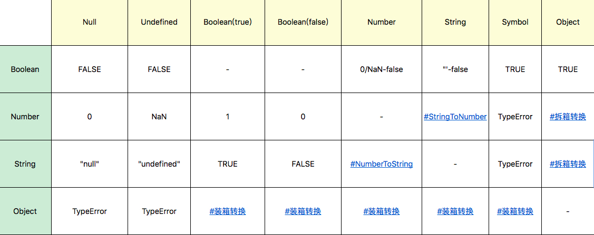

# JavaScript类型：关于类型，有哪些你不知道的细节

任何语言，其基本类型都是每个程序员必须掌握的概念，但是，这些概念你是真正的全部了解吗？其中包含哪些细节内容？看看下面的几个问题。

- 为什么有的编程规范要求用 void 0 代替 undefined？
- 字符串有最大长度吗？
- 0.1 + 0.2 不是等于 0.3 么？为什么 JavaScript 里得到的答案不是这样的？
- ES6 新加入的 Symbol 对象是什么？
- 为什么给对象添加的方法能用在基本类型上？

前面的学习过程中，对 JavaScript 模块从运行时、文法和执行过程三个角度去进行剖析了其知识体系，这里的学习内容就是从运行时的角度去看 JavaScript 的类型系统的。  
> 运行时类型是代码实际执行过程中我们用到的类型，所有的类型数据都会属于7个类型之一。从变量、参数、返回值到表达式中间结果，任何 JavaScript 代码运行过程中产生的数据，都具有运行时类型。

## 类型

JavaScript 语言的每一个值都属于某一种数据类型，JavaScript 语言规定了 7 种语言类型。  
语言类型广泛用于变量、函数参数、表达式、函数返回值等场合，根据最新的语言标准，这7种语言类型是：

1. Undefined
2. Null
3. Boolean
4. String
5. Number
6. Symbol
7. Object

除了ES6中新加入的 Symbol 类型，其余 6 种类型都是我们日常开发常用的，但是，文章开头的几个问题要得到解决就需要对这几个老知识进行重新认识。

## Undefined、Null

前面的第一个问题，为什么有的编程规范要求用 void 0 代替 undefined？  
  
Undefined 类型表示未定义，它的类型只有一个值，就是 undefined。任何变量在赋值前都是 Undefined 类型，其值为 undefined，一般我们可以用全局变量 undefined (就是名为 undefined 的这个变量) 来表达这个值，或者 void 运算来把任意一个表达式变成 undefined 值。  
  
但是，因为 JavaScript 的代码 undefined 是一个变量，而并非是一个关键字(这是 JavaScript 语言公认的设计失误之一)，所以，我们为了避免无意中被篡改，在代码中通常建议使用 void 0 来获取 undefined 值。(在现代浏览器中我们直接将 undefined 变量进行赋值再进行改变是咩有任何作用的，原因是问什么呢？在 MDN 中<https://developer.mozilla.org/zh-CN/docs/Web/JavaScript/Reference/Global_Objects/undefined>有详细的描述，其描述为自 ECMAscript5标准以来undefined是一个不能被配置[non-configurable]，不能被重写[non-writable]的属性，因此在现在浏览器中我们改变它的值是没有任何作用，即便这样，也要避免重写它)  
  
Undefined 跟 null 有一定的表意差别，null 表示的是：“定义了但是为空”。所以，在实际编码过程中，一般不会把变量赋值为 undefined，这样可以保证所有值为 undefined 的变量都是从未赋值过的自然状态。  
  
Null 类型也只有一个值，就是 null，它的语义表示空值，与 undefined 不同，null 是 JavaScript 关键字，所以在任何代码中都可以放心使用 null 关键字来获取 null 值。

## Boolean

Boolean 类型有两个值，true 和 false，它用于表示逻辑意义上的真和假，同样有关键字 true 和 false 来表示两个值。

## String

这里先看第二个问题，字符串是否有最大长度？  
  
String 用于表示文本数据，String 有最大长度，且值是 Math.pow(2,53) - 1，这在一般开发中都够用，但有趣的是，这个所谓的最大长度并不完全是我们理解中的字符数。  
  
因为 String 的意义并非“字符串”，而是字符串的 UTF16 编码，我们字符串的操作 charAt、charCodeAt、length 等方法针对的都是 UTF16 编码。所以，字符串的最大长度实际上是受字符串的编码长度影响的。
> Note: 现行的字符集国际标准，字符是以 Unicode 的方式表示的，每一个 Unicode 的码点表示一个字符，理论上，Unicode 的范围是无限的。 UTF 是 Unicode 的编码方式，规定了码点在计算机中的表示方法，常见的有 UTF16 和 UTF8。Unicode 的码点通常用 U+??? 来表示，其中 ??? 是十六进制的码点值。0-65536 (U+0000 - U+FFFF) 的码点被称为基本字符区域(BMP)。
  
JavaScript 中的字符串是永远无法变更的，一旦字符串构造出来，无法用任何方式改变字符串的内容，所以字符串具有值类型的特征。  
  
JavaScript 字符串把每个 UTF16 单元当做一个字符来处理，所以处理非 BMP(超出U+0000 - U+FFFF)范围的字符时，应当小心操作。  
  
JavaScript 这个设计继承自 Java，最新标准的解释是：为了“性能和尽可能实现起来简单”，因为现实中很少有能用到 BMP 之外的字符的场景。

## Number

Number 类型表示我们通常意义上的“数字”，这个数字大致对应数学中的有理数，但是在计算机中，它是有一定精度限制的。  
  
JavaScript 中的 Number 类型有 18437736874454810627(Math.pow(2,64) - Math.pow(2,53) + 3)个值。  
  
JavaScript 中的 Number 类型基本符合 IEEE754-2008规定的双精度浮点数规则，但是 JavaScript 为了表达几个额外的语言场景(当0作为除数时不出错引入了无穷大的概念)，规定了几个特殊情况：

- NaN，占用了 9007199254740990，这原本是符合 IEEE 规则的数字
- Infinity，无穷大
- -Infinity，负无穷大

另外值得注意的是，在 JavaScript 中有 +0 和 -0，在加法类运算中他们没有区别，但是除法的场合则需要特别留意区分，“忘记检测除以-0而得到负无穷大”的情况经常导致错误，而区分 +0 和 -0 的方式就是利用除法 1/x 是 Infinity 还是 -Infinity 来进行。  
  
根据双精度浮点数的定义，非整数的 Number 类型无法用 == (===也不行) 来进行比较，一段著名的代码也就是第三个问题，为什么在 JavaScript 中，0.1 + 0.2 不等于 0.3：

``` javascript
console.log(0.1 + 0.2 == 0.3)
// false
```

这里的结果是 false，即两边不等，这是浮点运算的特点，浮点数运算的精度问题导致等式左右的结果并不是严格相等，而是相差了几个微小的值。  
  
所以实际上，这里错误的不是结论，而是比较的方法，正确的比较方法是使用 JavaScript 提供的最小精度值：

``` javascript
console.log(Math.abs(0.1 + 0.2 - 0.3) <= Number.EPSILON);
// true
```

这里得到的结果为 true，等式左右两边差的绝对值在最小精度范围内，这就是 JavaScript 正确比较浮点数的方法。(`Number.EPSILON` 是最小精度)

## Symbol

Symbol 是 ES6 中引入的新类型，它是一切非字符串的对象 key 的集合，在 ES6 规范中，整个对象系统被用 Symbol 重塑。  
  
Symbol 可以具有字符串类型的描述，但是即使描述相同，Symbol 也不相等。  

创建一个全局的 Symbol 函数，例如：

``` javascript
var mySymbol = Symbol("my symbol");
```

一些标准中提到的 Symbol，可以在全局的 Symbol 函数的属性中找到；例如，可以使用 Symbol.iterator 来自定义 for ... of 在对象上的行为：

``` javascript
var o = new Object();
o[Symbol.iterator] = function() {
  var v = 0;
  return {
    next: function() {
      return {value: v++, done: v > 10}
    }
  }
}

for (var v of o)
  console.log(v);
  // 0 1 2 3 ... 9
```

代码中定义了 iterator 之后，用 for(var v of o) 就可以调用这个函数，然后根据函数的行为，产生一个 for ... of 的行为。  
  
这里代码给对象 o 添加了一个 Symbol.iterator 属性，并且按照迭代器的要求定义了一个 0 到 10 的迭代器，之后就可以在 for of 中使用这个 o 对象了。  
  
这些标准中被称为“众所周知”的 Symbol，也构成了语言的一类接口形式，他们允许编写与语言结合更紧密的 API。

## Object

Object 是 JavaScript 中最复杂的类型，也是 JavaScript 的核心机制之一。  
  
看文章前面给出的最后一题，为什么给对象添加的方法能用在基本类型上？  
  
在 JavaScript 中，对象的定义是“属性的集合”。属性分为数据属性和访问属性，两者都是 key-value 结构，key 可以是字符串或者 Symbol 类型。  
  
提到对象，这里就必须提到另一个概念：类。  
  
在 C++ 和 Java 中，每个类都是一个类型，二者几乎等同，以致于很多人常常把 JavaScript 的“类”与类型混淆。  
  
事实上，JavaScript 中的“类”仅仅是运行时对象的一个私有属性，而 JavaScript 中是无法自定义类型的。  
  
JavaScript 中的几个基本类型，都在对象类型中有一个“亲戚”，他们是：

- Number
- String
- Boolean
- Symbol

所以，必须认识到 3 与 new Number(3) 是完全不同的值，它们一个是 Number 类型，一个是对象类型。  
  
Number、String、和 Boolean，三个构造器是两用的，当跟 new 搭配时，他们产生对象，当直接调用时，它们表示强制类型转换。  
  
Symbol 函数比较特殊，直接用 new 调用它会抛出错误，但它仍然是 Symbol 对象的构造器。  
  
JavaScript 语言设计上试图模糊对象和基本类型之间的关系，我们日常代码可以把对象的方法在基本类型上使用，比如：

``` javascript
console.log("abc".charAt(0));
// a
```

升职我们在原型上添加方法，都可以应用到基本类型，如下：

``` javascript
Symbol.prototype.hello = function() { return console.log("hello"); }

var a = Symbol("a");
console.log(typeof a);
// symbol，a 并非对象
a.hello();
// 打印出 hello
```

所以文章开头最后一个问题的答案就是 . 运算符提供了装箱(把基本数据类型转换为对应的引用类型的操作)操作，它会根据基础类型构造一个临时对象，使我们能在基础类型上调用对应对象的方法。  
> Note:
> 装箱 —— 把基本数据类型转换为对应的引用类型的操作
> 拆箱 —— 把引用类型转换为基本数据类型的操作

## 类型转换

前面说完了基本类型，这里再说一下类型转换。  
  
因为 JavaScript 是弱类型语言，所以类型转换发生非常频繁，大部分我们熟悉的运算都会先进行类型转换。大部分类型转换符合人类的直觉，但是如果我们不去理解类型转换的严格定义就会很容易造成一些代码中的判断失误。  
  
其中最为严重的就是 “==” 运算，因为试图实现跨类型的比较，它的规则复杂到几乎没有人能记住，在很多书中都介绍的是设计失误并推荐不使用 “==”，而是使用 “===” 号进行比较。  
  
其它运算如加减乘除大于小于也都会涉及类型转换，幸好的是大部分的类型转换都比较简单，如下：

在这里，较为复杂的部分就是 Number 和 String 的转换，以及对象跟基本类型之间的转换；下面学习一下这几种转换的规则。

## StringToNumber

字符串到数字的类型转换，它存在一个语法结构，类型转换支持十进制、二进制、八进制和十六进制，比如：

- 30
- 0b111
- 0o13
- 0xFF

此外，JavaScript 支持的字符串语法还包括正负号科学计数法，可以使用大写或者小写的 e 来表示：

- 1e3
- -1e-2

这里需要注意的是，parseInt 和 parseFloat 并不适用这个转换，所以支持的语法跟这里不尽相同。  
  
在不传入第二个参数的情况下，parseInt 只支持 16 进制前缀 “0x”，而且会忽略非数字字符，也不支持科学计数法。  
  
多数情况下， Number 比 parseInt 和 parseFloat 更好。  
  
## NumberToString

在较小的范围，数字到字符串的转换是完全符合直觉的十进制表示。当 Number 绝对值较大或较小是，字符串表示则是使用科学计数法表示的。  
  
这里介绍了 JavaScript 运行时的类型系统，类型在 JavaScript 中还是有很多需要注意的地方。